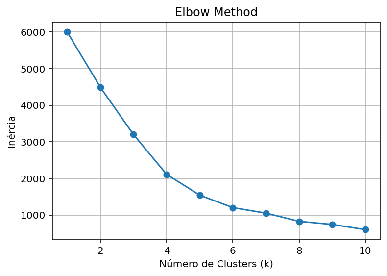
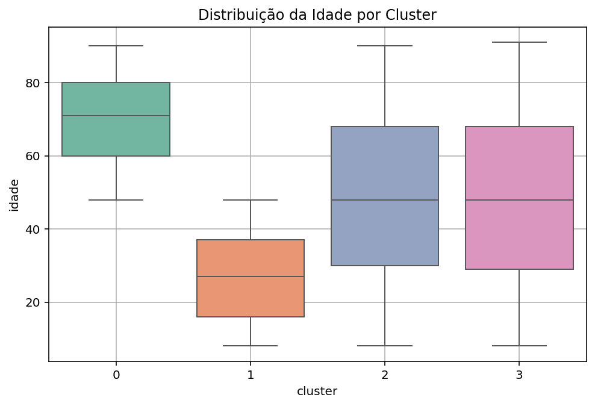
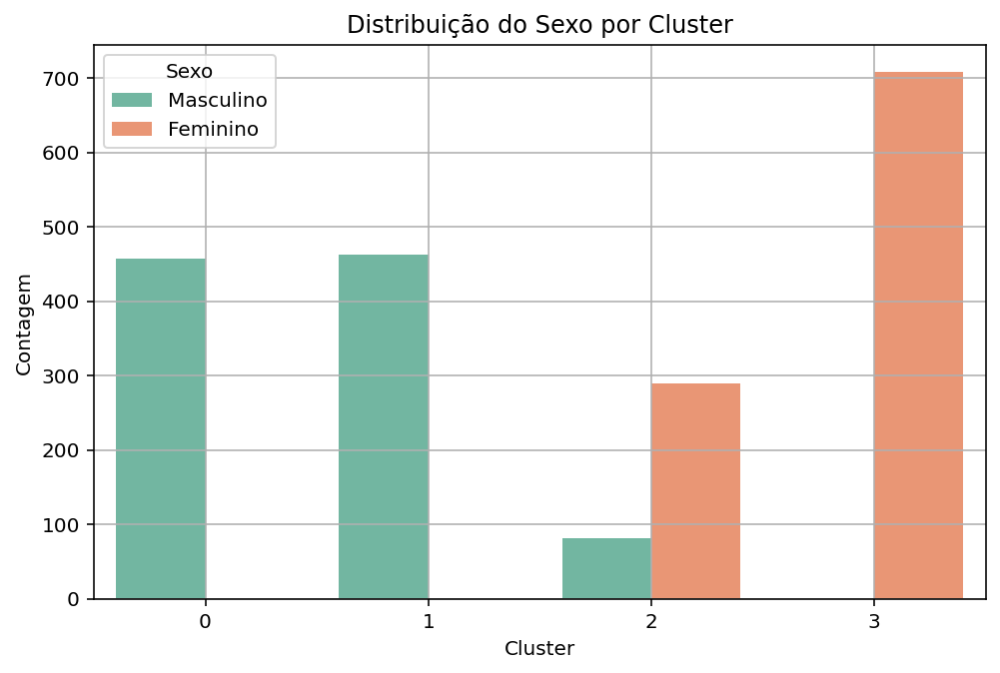
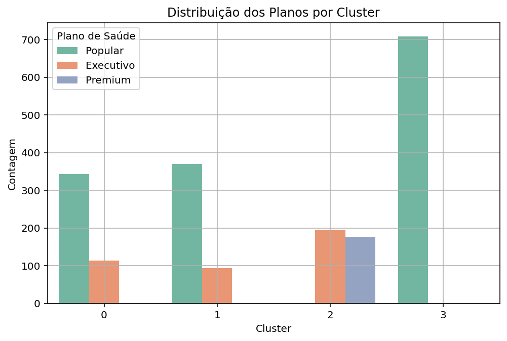
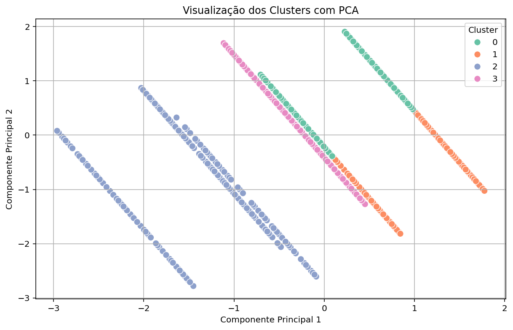

# Patient Segmentation with Clustering and PCA
All data is artificial and was created exclusively for educational and portfolio purposes.

## Description
This document presents the results of the patient clustering step based on their demographic and health plan characteristics. The analysis was performed using the KMeans algorithm, with previously generated fictitious data.

## Objective of the Clustering
Group patients with similar profiles using the following variables:

- Age
- Sex
- Health plan

The main objective is to identify hidden patterns that may be useful for:

- Strategic segmentation
- Service personalization
- Exploratory analysis of the patient base

## Steps Performed

### 1. Preprocessing
- Conversion of birth date into age.
- Standardization of numerical variables using StandardScaler.
- Encoding of categorical variables.

### 2. Choosing the Number of Clusters
- The Elbow Method was used to evaluate the inertia variation for different values of k (from 1 to 10).
- A clear inflection point was identified at k=4, which was the value used for clustering.

### 3. Cluster Results
After applying the algorithm with k = 4, the following average attributes per cluster were obtained:

| Cluster | Average Age | Sex (0=Fem, 1=Male) | Health Plan (0=Basic, 1=Executive, 2=Premium) |
|---------|-------------|---------------|--------------|
| 0       | 70.20       | 1.00          | 0.25         |
| 1       | 26.91       | 1.00          | 0.20         |
| 2       | 48.54       | 0.22          | 1.48         |
| 3       | 48.52       | 0.00          | 0.00         |

**Cluster Interpretation:**

**Cluster 0: Elderly men with predominance of the Basic plan.**
**Cluster 1: Young men with predominance of the Basic plan.**
**Cluster 2: Mostly middle-aged women with predominance of Premium and Executive plans.**
**Cluster 3: Middle-aged women only with the Basic plan.**

#### Boxplot for the Age variable by cluster.

#### Countplots for the Sex and Plan variables by cluster.

## Conclusions
The clustering was effective in grouping patients with similar characteristics, revealing profiles that can be explored for strategic decisions. This segmentation can also be integrated into future analyses, such as prediction of plan adherence or detection of behavior patterns by group.

The cluster analysis enabled the discovery of four distinct profiles among the clinic’s patients. This segmentation can be used as a basis for:

- Targeted service and communication strategies
- Analysis of health plan distribution by profile
- Resource prioritization based on the most relevant groups

This process does not aim to predict diseases or behaviors directly, but to group individuals with similar characteristics, allowing for deeper future analyses or applications with supervised models.

## Visualization with PCA
To facilitate the interpretation of the formed clusters, I applied the Principal Component Analysis (PCA) technique, reducing the data dimensionality from three variables (age, gender, health_plan) to two main components (PCA1 and PCA2).

The main objective was to generate a two-dimensional visualization of the groups identified by the KMeans algorithm, without losing the essential variability of the data.

The resulting chart showed that the clusters are clearly separated from each other, with low overlap, which visually validates the proposed segmentation.

This step added value to the analysis by allowing:

- Visual validation of the separation between clusters
- Reinforcement of the quality of the proposed grouping
- A visual basis for future strategic decisions or in-depth analyses

The PCA visualization reinforced the validity of the clusters and facilitated the communication of the results, closing this stage with a clear and interpretable representation.
